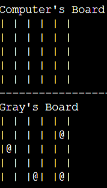

# Extreme Battleships

Extreme Battleships is a Python terminal game, which uses the Code Institute mock terminal on Heroku.

Users can attempt to beat the computer by finding all their battleships before the computer can locate their ships. The user can set the board size and amount of ships that each player has thereby increasing or decreasing the difficulty. The game is over when either the computer or the player finds all the opposing ships. A draw is also possible if the final ship of both players is found on the same turn.

The live version of the project can be found [here](https://extreme-battleships-0e054539df86.herokuapp.com/).

## How to play

Extreme battleships is based on the classic battleships game. More can be found on [Wikipedia](https://en.wikipedia.org/wiki/Battleship_(game))

In this game, the player enters their name and what size they would like the board to be (min(3x3), max(10x10)). They also enter how many ships they want each board to have (min(3), max(8)).

The player can see their ships on their board, denoted by @. However, the computer's ships are hidden.

The player and computer each take a guess in turn. The aim is to sink eachother's ships by guessing the correct location.

Misses are highlighted on each board with **'X'** and hits are shown as **'*'**.

The player to sink all the opposing ships first is declared the winner.

## Existing Features 

- Player input:
    - Player can enter the desired board size (min(3x3), max(10x10)).
    - Player can enter how many ships they want each board to have (min(3), max(8)).

 
e.g 7x7 board with 5 ships.
 

- Random ship generation
    - Ships are randomly placed on both the player and computer board. They are invisble on computer board.

 
e.g 5x5 board with 4 ships.
 

- Player can enter guess.

- Displays scores after each round.

- Input validation/error checking
    - Player/computer cannot make same guess twice.
    - A guess off the size of the board cannot be made.
    - Row/Column guesses must be an integer.

e.g Below a guess made outside board size.

e.g Non-integer inputted for a guess.

e.g Entering a guess that has already been made.

- Data maintained in class instances

- Player can stop the game after each round.

